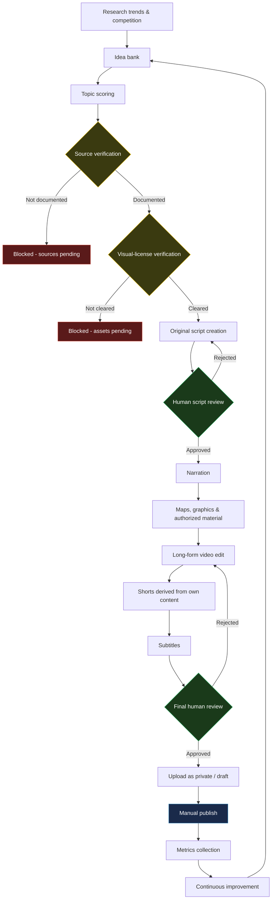

# Original Faceless Content Automation (Europe Geography & Infrastructure)

A portfolio project demonstrating a governed, source-and-license-aware automation pipeline for producing **original, faceless YouTube content** — narrated videos about European geography, infrastructure, cities, borders, and curiosities, initially in Spanish.

> **Status:** Project pivoted from a third-party clipping concept to an original-content pipeline after a risk review (see [`docs/decisions/ADR-001-pivot-to-original-faceless-content.md`](docs/decisions/ADR-001-pivot-to-original-faceless-content.md)). Stage 2 did real topic research, idea banking, and scoring within a European-geography focus. Stage 2B then independently researched and scored 8 candidate niches/formats (geography included, on equal footing) and produced a **provisional shortlist awaiting a human decision** — see [`docs/decisions/ADR-002-niche-format-shortlist-pending-decision.md`](docs/decisions/ADR-002-niche-format-shortlist-pending-decision.md). **No niche has been finalized.** No video production, scripting, or publishing automation has been implemented yet.

## Business problem

Producing a consistent stream of original, well-researched video content is slow and easy to get wrong: finding topics worth covering, verifying the facts behind them, writing an accurate script, sourcing visuals that are actually cleared to use, and only then editing and publishing. This project originally explored automating short-clip production from *other creators'* videos, but a risk review found that approach carried meaningful copyright, content-reuse, and monetization risk (see the ADR linked above). The problem this project now solves is different: how to responsibly speed up the early, repetitive parts of producing **original** video content — research, idea prioritization, source documentation, and script drafting — without skipping fact-checking, licensing, or human review.

## Proposed solution

An automation-assisted, human-supervised pipeline that:

1. Researches trends and competition to build an idea bank of candidate topics.
2. Scores topics for trend strength, competition gap, novelty, and geographic fit.
3. **Blocks any topic from reaching script drafting until its factual sources are documented and verified.**
4. Assists drafting an original script using only verified sources — never copying another channel's script.
5. Requires mandatory human review of every script before narration.
6. **Blocks any visual or audio asset (map, photo, footage, music) from being used in a video until its license is explicitly verified** under a 7-category license taxonomy.
7. Assembles narration, visuals, and long-form edits; derives Shorts from the project's *own* finished video.
8. Requires a second, final human review before anything is uploaded.
9. Publishes only manually, by a human — never automatically.
10. Tracks post-publish performance metrics to inform future topic selection.

Rights verification is a hard gate at two independent points — sources (facts) and visual/audio assets (media) — not a formality bolted on afterward.

## MVP scope

- 3 Spanish-language long-form videos.
- 9-12 Shorts derived from those videos (own content only).
- Estimated 6-week timeline.
- Every publish action requires human approval; no automatic publishing.
- No mass production, no copying scripts/thumbnails/videos from other channels.
- The first real automation being built targets research, idea banking, topic scoring, source documentation, assisted script drafting, and state logging — see [`docs/06-roadmap.md`](docs/06-roadmap.md).

## Architecture overview



Full component breakdown: [`docs/02-workflow-architecture.md`](docs/02-workflow-architecture.md).

## Technologies

| Layer | Technology | Role |
|---|---|---|
| Orchestration | [n8n](https://n8n.io) | Workflow automation, source/license gate routing, human-review checkpoints |
| Production (planned) | Python + [FFmpeg](https://ffmpeg.org) | Long-form editing, Shorts derivation, subtitle generation |
| AI assistance (planned) | LLM prompts (provider-agnostic) | Topic scoring, script-draft assistance, Shorts segment scoring, metadata generation |
| Data tracking | CSV registries | Topic bank, source verification, visual-asset licensing, performance metrics |
| Version control | Git + GitHub | Change history, review, portfolio presentation |

## Human-in-the-loop controls

- **Source verification is never automatic.** A topic cannot reach script drafting without documented, human-verified sources (see [`docs/04-data-dictionary.md`](docs/04-data-dictionary.md)).
- **Visual-asset licensing is never automatic.** An asset cannot be used until a human sets `approval_status = VERIFIED` and `human_review_completed = TRUE` (see [`docs/03-visual-asset-rights-policy.md`](docs/03-visual-asset-rights-policy.md)).
- **Topic scoring never fabricates data.** A dimension the system can't actually measure (e.g., live search-trend data) is logged as `NOT_MEASURED`, never guessed — and a topic is hard-blocked (`BLOCKED_NO_SOURCES` / `BLOCKED_NO_VISUAL_RIGHTS`) the moment sources or visual resources are found `INSUFFICIENT`, regardless of how high its score is. Only a human can mark a topic's gates `CONFIRMED`. See [`docs/07-topic-scoring-methodology.md`](docs/07-topic-scoring-methodology.md).
- **AI scoring and drafting are advisory only.** Prompts explicitly flag unverified claims or asset concerns instead of resolving them, and every AI-assisted script draft carries a fixed human-review notice.
- **Two independent human checkpoints** — script review and final pre-publish review — sit between drafting and publishing.
- **Publishing is always a manual human action.** No automatic or scheduled publish path exists anywhere in this system.

## Copyright and authorization safeguards

- Content is original by design — the pipeline no longer reuses other creators' whole videos (see the ADR for why).
- Individual visual/audio assets are classified into one of seven categories (`ORIGINAL`, `OWN_MATERIAL`, `PUBLIC_DOMAIN`, `CREATIVE_COMMONS_COMPATIBLE`, `LICENSED`, `DIRECT_PERMISSION`, `UNAUTHORIZED`) and can only be used once `VERIFIED`.
- No asset may be used without all 8 mandatory fields recorded: source, author, license type, original URL, verification date, allowed scope, evidence reference, and approval status.
- An asset being easy to find, labeled "royalty-free" without checking terms, or already used by others is never treated as sufficient basis for approval.
- Scripts must never copy or closely paraphrase another channel's script, thumbnail, or video.
- Full detail: [`docs/03-visual-asset-rights-policy.md`](docs/03-visual-asset-rights-policy.md).

## Repository structure

```text
clipping-automation-portfolio/
├── README.md
├── .gitignore
├── docs/
│   ├── decisions/            # Architecture Decision Records (ADRs), including the pivot rationale
│   ├── 01-business-case.md
│   ├── 02-workflow-architecture.md
│   ├── 03-visual-asset-rights-policy.md
│   ├── 04-data-dictionary.md
│   ├── 05-mvp-testing-plan.md
│   ├── 06-roadmap.md
│   ├── 07-topic-scoring-methodology.md
│   ├── 08-market-research-report.md
│   ├── 09-niche-scoring-methodology.md
│   └── 10-niche-selection-process-map.md
├── n8n/                       # Importable n8n workflow skeletons + their own README
├── templates/                 # CSV registries and permission/authorization templates
├── prompts/                   # AI prompt templates (topic scoring, script draft, Shorts scoring, metadata)
├── scripts/                   # Placeholder for future Python/FFmpeg/TTS automation scripts
├── tests/                     # Manual validation checklist
├── results/                   # Sample (fictitious) results output
└── private/                   # Local-only folder, excluded from version control except its README
```

## Current status

**Stage 2B — Deep market, niche & format research complete; decision pending.** Stage 2 seeded the idea bank ([`templates/topic-registry.csv`](templates/topic-registry.csv)) with 5 real, sourced candidate topics scored under a 7-dimension methodology ([`docs/07-topic-scoring-methodology.md`](docs/07-topic-scoring-methodology.md)) — every topic sits at `status = PENDING_HUMAN_REVIEW`. Stage 2B then independently researched 8 candidate niches/formats against 16 real comparable channels ([`templates/channel-video-registry.csv`](templates/channel-video-registry.csv)) and scored them ([`templates/niche-format-comparison.csv`](templates/niche-format-comparison.csv)), producing a provisional shortlist of 4 in [`docs/decisions/ADR-002-niche-format-shortlist-pending-decision.md`](docs/decisions/ADR-002-niche-format-shortlist-pending-decision.md) — **status: Proposed, awaiting a human decision.** No source-registry verification, scripting, narration, editing, or publishing automation exists yet.

## Planned stages

See the detailed status table in [`docs/06-roadmap.md`](docs/06-roadmap.md).

| Stage | Scope | Status |
|---|---|---|
| Governance & pipeline skeleton | Documentation, rights/license policy, registries, n8n skeletons | **Completed (Stage 1, adapted for the pivot)** |
| Research, idea bank & scoring | Real topic research, 7-dimension scoring, blocking rule | **Completed (Stage 2)** |
| Deep market/niche/format research | 8-niche comparison, real evidence, provisional shortlist | **Completed (Stage 2B) — decision pending** |
| Source & visual-asset verification | Human confirmation of sourced topics' gates | Next |
| Assisted script drafting | AI-assisted drafting from verified sources, human review | Planned |
| Visual-asset production | Sourcing/clearing maps, graphics, footage, music per the license gate | Planned |
| Narration & editing | TTS/narration, long-form assembly, Shorts derivation, subtitles | Planned |
| Review & publishing | Human review checkpoints, manual publish | Planned (manual by design) |
| Metrics | Performance tracking and feedback into topic scoring | Planned |

## Skills demonstrated

- Recognizing and acting on business/legal risk in a system design, including a documented strategic pivot (ADR)
- Workflow automation design (n8n)
- Content-provenance and licensing governance design
- Structured data modeling (CSV registries, data dictionary)
- AI prompt engineering with explicit safety and human-oversight constraints
- Technical documentation for a portfolio audience
- Git branch hygiene and pull-request-based change review

## Limitations

- No automation currently runs end-to-end; this stage is structural and documentation-only.
- Both n8n workflow skeletons use fictitious data and have not been validated against a specific n8n instance version.
- CSV registries contain only fictitious example rows for illustration.
- No AI provider, TTS/narration service, or publishing API has been integrated yet.
- License-verification decisions in this repository are procedural placeholders — no asset has actually been licensed or cleared.

## Disclaimer

This project is a technical and process-design portfolio piece. **It does not provide legal advice.** The visual-asset rights policy and templates in this repository describe an operational review process, not a legal determination. Any real-world use of this system must involve qualified legal review of applicable copyright, licensing, and platform terms before any asset is used commercially.
