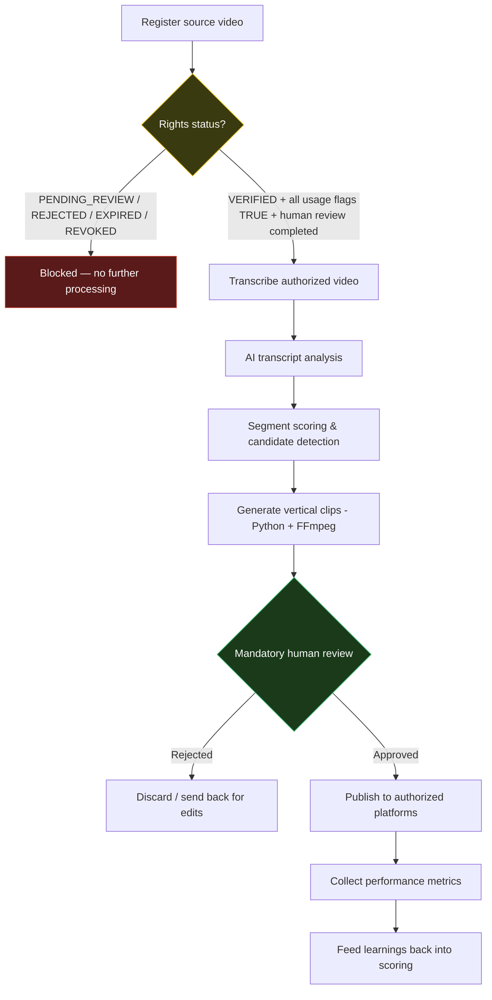

# Clipping Automation Portfolio

A portfolio project demonstrating a governed, rights-aware automation pipeline for turning long-form video into short vertical clips — built with n8n, Python, FFmpeg, and AI-assisted content analysis.

> **Status:** Stage 1 — Project structure and governance completed. No live automation, content ingestion, or publishing has been implemented yet.

## Business problem

Short-form vertical video (Shorts, Reels, TikTok) is one of the highest-leverage distribution channels for creators and brands, but producing clips at scale is expensive: it requires manually watching source footage, identifying strong moments, cutting and reformatting video, and — critically — confirming that the source material may legally be reused. Most "clipping" workflows skip the rights-verification step entirely, which creates real legal and platform risk (copyright strikes, takedowns, account bans, and reputational damage).

## Proposed solution

An end-to-end, human-supervised pipeline that:

1. Registers candidate source videos in a structured intake registry.
2. **Blocks any source without explicitly verified commercial reuse rights** before any further processing happens.
3. Transcribes only authorized sources.
4. Uses AI to analyze transcripts and score candidate segments for clip potential.
5. Generates vertical clips with Python + FFmpeg.
6. Requires a mandatory human review checkpoint before anything is published.
7. Publishes only to explicitly authorized platforms.
8. Tracks post-publish performance metrics for continuous improvement.

The system is designed so that **rights verification is a hard gate, not a formality** — a video cannot reach transcription, scoring, clip generation, or publishing unless its rights status is `VERIFIED` under the policy defined in [`docs/03-content-rights-policy.md`](docs/03-content-rights-policy.md).

## MVP scope (Stage 1)

This stage delivers the **governance and structural skeleton** of the system, not working automation:

- Repository structure, documentation, and architecture overview.
- A formal content-rights policy with explicit allowed/blocked states.
- CSV-based registries for content intake, rights tracking, and performance metrics (seeded with fictitious example rows only).
- A permission-request template and authorization checklist for reaching out to rights holders.
- An importable n8n workflow skeleton that demonstrates the intake → rights-gate → routing logic using only fictitious data, standard nodes, and no paid or external API calls.
- AI prompt templates for segment scoring and metadata generation, both explicitly scoped to authorized transcripts only.
- A validation checklist for what must be checked before any future stage ships real automation.

No videos are downloaded, no third-party content is reused, no social platform is published to, and no paid API is called in this stage.

## Architecture overview

The target end-to-end system (Stages 1–10 of the roadmap) looks like this:



Stage 1 implements the registries, the rights-gate policy, and an n8n skeleton that models the decision logic (`B` and the routing into `VERIFIED` / `PENDING_REVIEW` / `REJECTED` branches) above. Steps `C` through `K` are documented as planned work but not implemented yet — see [`docs/06-roadmap.md`](docs/06-roadmap.md).

## Technologies

| Layer | Technology | Role |
|---|---|---|
| Orchestration | [n8n](https://n8n.io) | Workflow automation, rights-gate routing, human-review checkpoints |
| Clip generation (planned) | Python + [FFmpeg](https://ffmpeg.org) | Vertical reformatting, cutting, rendering |
| AI analysis (planned) | LLM prompts (provider-agnostic) | Transcript analysis, segment scoring, metadata generation |
| Data tracking | CSV registries | Content intake, rights status, performance metrics |
| Version control | Git + GitHub | Change history, review, portfolio presentation |

## Human-in-the-loop controls

- **Rights verification is never automatic.** A source can only be marked `VERIFIED` after a documented human review (see [`docs/03-content-rights-policy.md`](docs/03-content-rights-policy.md)).
- **AI scoring is advisory only.** The segment-scoring prompt explicitly returns a `rights_risk_flag` and instructs that any risk signal forces human review — the AI never approves or rejects content on rights grounds.
- **Publishing requires a second human checkpoint** after clip generation, independent of the rights-verification checkpoint, before anything reaches a public platform.
- **No destructive or irreversible action** (publishing, deleting registries, revoking rights) is meant to be triggered automatically by this pipeline.

## Copyright and authorization safeguards

- A video's public availability, "clip" buttons, download options, or platform sharing features are **never** treated as authorization.
- Attribution, short clip length, creator silence, or "no copyright intended" disclaimers are **never** treated as authorization.
- "Fair use" is **never** used as an automatic approval mechanism — it requires case-by-case legal judgment that this system does not provide.
- The policy explicitly accounts for multiple, independent rights holders that may apply to a single piece of content (creator, platform, music owner, game/broadcast owner, guests, sponsors).
- Full detail: [`docs/03-content-rights-policy.md`](docs/03-content-rights-policy.md).

## Repository structure

```text
clipping-automation-portfolio/
├── README.md
├── .gitignore
├── docs/                     # Business case, architecture, rights policy, data dictionary, test plan, roadmap
├── n8n/                      # Importable n8n workflow skeleton + its own README
├── templates/                # CSV registries and permission-request / authorization templates
├── prompts/                  # AI prompt templates (segment scoring, metadata generation)
├── scripts/                  # Placeholder for future Python/FFmpeg automation scripts
├── tests/                    # Manual validation checklist
├── results/                  # Sample (fictitious) results output
└── private/                  # Local-only folder, excluded from version control except its README
```

## Current status

**Stage 1 — Project structure and governance completed.**

Only the structural skeleton, documentation, policy, registries (with fictitious sample data), and a non-functional n8n demonstration workflow exist. No real content has been ingested, transcribed, scored, clipped, or published.

## Planned stages

| Stage | Scope |
|---|---|
| 1 | Project structure, documentation, rights policy, registries, n8n skeleton *(this stage)* |
| 2 | Source intake automation and rights-gate enforcement in n8n |
| 3 | Transcription pipeline for authorized sources |
| 4 | AI-assisted transcript analysis and segment scoring |
| 5 | Candidate segment detection and shortlisting |
| 6 | Python + FFmpeg vertical clip generation |
| 7 | Mandatory human review interface/checklist before publishing |
| 8 | Authorized-platform publishing integration |
| 9 | Performance metrics collection and reporting |
| 10 | End-to-end pipeline hardening and portfolio write-up |

## Skills demonstrated

- Workflow automation design (n8n)
- Data governance and rights-management policy design
- Structured data modeling (CSV registries, data dictionary)
- AI prompt engineering with explicit safety and human-oversight constraints
- Technical documentation for a portfolio audience
- Git branch hygiene and pull-request-based change review

## Limitations

- No automation currently runs end-to-end; Stage 1 is structural and documentation-only.
- The n8n workflow skeleton uses fictitious data and has not been validated against a specific n8n instance version.
- CSV registries contain only fictitious example rows for illustration.
- No AI provider, transcription service, or publishing API has been integrated yet.
- Rights-verification decisions in this repository are procedural placeholders — no rights have actually been verified for any content.

## Disclaimer

This project is a technical and process-design portfolio piece. **It does not provide legal advice.** The content-rights policy and templates in this repository describe an operational review process, not a legal determination. Any real-world use of this system must involve qualified legal review of applicable copyright, licensing, and platform terms before content is reused commercially.
