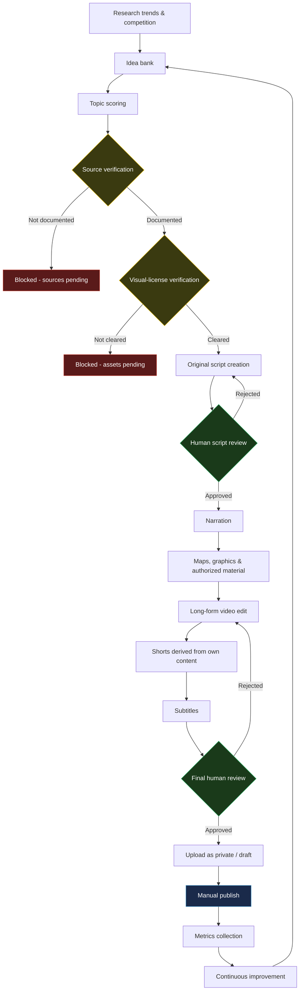

# 02 — Workflow Architecture

## Overview

The system is organized as a linear pipeline with two independent verification gates (source/fact documentation and visual-asset licensing) and two human checkpoints (script review and final pre-publish review). The diagram below mirrors the one in the root [README.md](../README.md).

## Components

### 1-3. Research, idea bank, topic scoring (current automation focus)

Candidate topics are logged in [`templates/topic-registry.csv`](../templates/topic-registry.csv) with category, region, and scores. [`prompts/topic-scoring-prompt.md`](../prompts/topic-scoring-prompt.md) assists scoring; [`n8n/stage-01-topic-research-pipeline.json`](../n8n/stage-01-topic-research-pipeline.json) demonstrates the branching logic with fictitious data. This is the first stage getting real automation — see [`06-roadmap.md`](06-roadmap.md).

### 4. Source verification (gate)

Every factual claim used in a script must trace back to a row in [`templates/source-registry.csv`](../templates/source-registry.csv). A topic cannot move to script creation until its sources are documented — modeled in the same n8n workflow as the "Sources Documented?" branch.

### 5. Visual-license verification (gate)

Every map, photo, footage clip, chart, or music track used in a video must have a `VERIFIED`, human-reviewed record in [`templates/visual-asset-registry.csv`](../templates/visual-asset-registry.csv), per [`03-visual-asset-rights-policy.md`](03-visual-asset-rights-policy.md). This is modeled independently in [`n8n/visual-asset-rights-gate.json`](../n8n/visual-asset-rights-gate.json), since asset sourcing happens per-video and can continue after the script is approved.

### 6-7. Script creation & human review

[`prompts/script-draft-assist-prompt.md`](../prompts/script-draft-assist-prompt.md) assists a human writer using only verified sources. It explicitly never copies another channel's script. Every draft requires human review before narration — the AI never approves its own output.

### 8-11. Narration, visuals, long-form edit, Shorts derivation (planned, not yet implemented)

Narration is recorded/generated for the approved script; cleared visual assets are assembled with Python + FFmpeg into the long-form video; [`prompts/shorts-segment-scoring-prompt.md`](../prompts/shorts-segment-scoring-prompt.md) assists identifying which moments of the **finished, original** long-form video work as standalone Shorts.

### 12-13. Subtitles & final human review (planned)

Subtitles are generated for both formats. A second, independent human review checks the finished video/Shorts — quality, factual accuracy, and that all visual assets used are still within their `VERIFIED` scope.

### 14-15. Private upload & manual publish (planned)

Approved videos are uploaded as private/draft first. Publishing itself is always a manual, human action — there is no automatic publish path in this system, now or in the roadmap (see MVP constraints in [`05-mvp-testing-plan.md`](05-mvp-testing-plan.md)).

### 16-17. Metrics & continuous improvement (planned)

Post-publish performance is logged in [`templates/performance-metrics.csv`](../templates/performance-metrics.csv), feeding back into which topics and formats to prioritize next.

## Data flow summary

| Stage in pipeline | Primary artifact | Current status |
|---|---|---|
| Research / idea bank / scoring | `topic-registry.csv` | Skeleton + sample data; first automation target |
| Source verification | `source-registry.csv` | Skeleton + sample data; first automation target |
| Visual-license verification | `visual-asset-registry.csv` | Skeleton + sample data + n8n demo gate |
| Script creation | `prompts/script-draft-assist-prompt.md` output | Prompt defined, not wired to automation |
| Narration / edit / Shorts / subtitles | (private, not versioned) | Not implemented |
| Human reviews | `tests/validation-checklist.md` (interim) | Checklist only |
| Publishing | External platform (manual) | Not implemented |
| Metrics | `performance-metrics.csv` | Skeleton + sample data |
