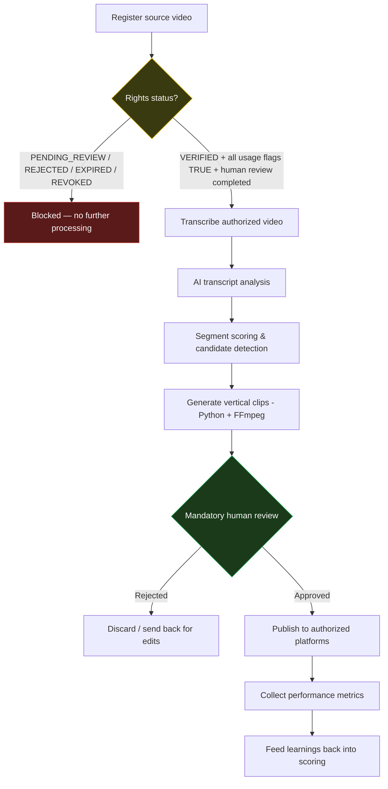

# 02 — Workflow Architecture

## Overview

The system is organized as a linear pipeline with one hard gate (content-rights verification) and two human checkpoints (rights review and pre-publish review). The diagram below mirrors the one in the root [README.md](../README.md).



## Components

### 1. Content intake (Stage 1 skeleton, Stage 2 automation)

Every candidate source is registered in [`templates/content-registry.csv`](../templates/content-registry.csv) with basic metadata (platform, creator, title, duration, language, niche). This is the entry point of the pipeline and does not imply any rights have been granted.

### 2. Rights gate (Stage 1 policy + skeleton, Stage 2 enforcement)

Every source also has a corresponding row in [`templates/rights-registry.csv`](../templates/rights-registry.csv). The gate logic, defined in full in [`03-content-rights-policy.md`](03-content-rights-policy.md), requires **all** of the following simultaneously before a source can proceed:

```text
rights_status = VERIFIED
commercial_use_allowed = TRUE
editing_allowed = TRUE
platform_use_allowed = TRUE
authorization_expired = FALSE
human_review_completed = TRUE
```

If any condition is not met, the source is routed to a blocked state (`HUMAN_REVIEW_REQUIRED` or `BLOCKED_RIGHTS`) and does not advance. The Stage 1 n8n skeleton in [`n8n/stage-01-content-intake.json`](../n8n/stage-01-content-intake.json) demonstrates this branching logic using fictitious data.

### 3. Transcription (planned — Stage 3)

Only sources that pass the rights gate are transcribed. Transcripts are treated as sensitive working data and are excluded from version control (see `.gitignore`).

### 4. AI transcript analysis & segment scoring (planned — Stage 4–5)

An AI prompt (see [`prompts/segment-scoring-prompt.md`](../prompts/segment-scoring-prompt.md)) scores candidate segments for hook strength, clarity, emotional impact, standalone viability, and brand safety, and flags any rights-risk signal it detects in the transcript itself (e.g., a mention suggesting undisclosed sponsorship or third-party material). The AI never makes the final rights determination.

### 5. Clip generation (planned — Stage 6)

Python orchestrates FFmpeg to cut and reformat approved segments into vertical video. This stage does not exist yet; `scripts/README.md` documents the intended approach.

### 6. Mandatory human review (planned — Stage 7)

Before publishing, a human reviewer confirms clip quality, brand safety, and — again — that the rights basis for the clip is still valid (rights can expire or be revoked between intake and publishing).

### 7. Publishing (planned — Stage 8)

Only authorized platforms (as recorded in `rights-registry.csv`'s `allowed_platforms` field) may receive a given clip.

### 8. Metrics (planned — Stage 9)

Post-publish performance is logged in [`templates/performance-metrics.csv`](../templates/performance-metrics.csv), including the rights status at time of publish for auditability.

## Data flow summary

| Stage in pipeline | Primary artifact | Stage 1 status |
|---|---|---|
| Intake | `content-registry.csv` | Skeleton + sample data |
| Rights verification | `rights-registry.csv` + policy doc | Skeleton + sample data |
| Transcription | (private, not versioned) | Not implemented |
| Scoring | `prompts/segment-scoring-prompt.md` output | Prompt defined, not wired to automation |
| Clip generation | (private, not versioned) | Not implemented |
| Human review | `tests/validation-checklist.md` (interim) | Checklist only |
| Publishing | External platforms | Not implemented |
| Metrics | `performance-metrics.csv` | Skeleton + sample data |
