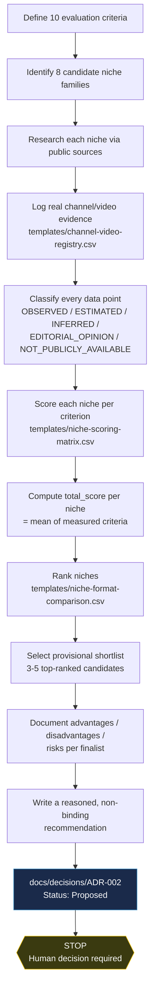

# 10 — Niche Selection Process Map (Stage 2B)

Visual summary of how Stage 2B moved from an open question ("which niche/format?") to a provisional shortlist awaiting a human decision. See [`08-market-research-report.md`](08-market-research-report.md) for the full findings and [`09-niche-scoring-methodology.md`](09-niche-scoring-methodology.md) for the scoring rules.

## What happens after the stop point (not part of this stage)

Only once a human reviews ADR-002 and records a decision does the project resume — either finalizing a niche (updating ADR-002's status and the roadmap) or requesting a deeper look at specific finalists. No script, narration, production, or publishing work begins before that decision, per this stage's explicit scope limit.
